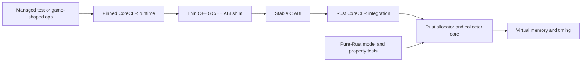

# Proposed design

Status: architectural hypothesis, not an implementation contract or construction
order. Learning missions may intentionally use a simpler design, discover its
failure, and replace it. Promote a proposal from this document into a required
invariant only when a current mission demonstrates the need.

## Design principles

1. **Correctness before latency.** A fast collector with one missed root is unusable.
2. **Separate mechanism from policy.** Heap layout, tracing, sweeping, and barriers should not depend on the choice between full-heap and frame-aware policy.
3. **Keep unsafe code narrow.** Raw memory belongs in private modules with explicit invariants; algorithms should operate on validated IDs, offsets, and views where possible.
4. **Pin the runtime contract.** CoreCLR's GC interface is versioned but not a stable public Rust ABI. Support one recorded runtime build at a time.
5. **Measure trade-offs.** Tail latency, CPU, memory, fragmentation, and fallback frequency are all first-class results.
6. **Make failure obvious.** Unsupported modes should fail at initialization, and debug builds should verify the heap aggressively.

## Architecture



### `gc-core`

Runtime-independent mechanisms:

- Region and object identifiers.
- Bump allocation and free-list allocation.
- Object walking and side metadata.
- Mark stacks and tracing.
- Sweep, split, and coalesce operations.
- Collector policies.
- Metrics and invariant verification.

The first version should use a byte-backed simulated heap, not native addresses. This allows Miri, property tests, deterministic fault injection, and a simple reference implementation.

### `gc-platform`

An intentionally small abstraction:

```rust
trait VirtualMemory {
    fn reserve(&self, size: usize, alignment: usize) -> Result<Reservation, VmError>;
    fn commit(&self, range: AddressRange) -> Result<(), VmError>;
    fn decommit(&self, range: AddressRange) -> Result<(), VmError>;
}
```

The initial implementation uses Windows reserve/commit semantics. `Reservation` owns the range and releases it on drop. Collector code should not call Windows APIs directly.

### `gc-runtime`

CoreCLR-specific knowledge:

- Managed object and free-object layout.
- Method-table fields needed for sizing and finalization.
- Positive and negative `GCDesc` decoding.
- Root callbacks and scan flags.
- Allocation-context management.
- Handle storage and semantics.
- Frozen segments, finalization, and sync-block weak scanning.

This crate may depend on `gc-core`, but `gc-core` must not depend on it.

### `gc-ffi` and `native-shim`

CoreCLR passes C++ virtual interfaces across the GC boundary. Rust has no stable C++ ABI, and hand-writing MSVC vtables would couple correctness to undocumented compiler details. The default design is therefore:

- C++ implements the exact interfaces from the pinned CoreCLR headers.
- Each method immediately delegates through a narrow `extern "C"` Rust API.
- Rust owns the GC state and all policy.
- C++ converts no object graphs and stores no independent heap state.
- Every boundary catches errors. Rust panics abort or become an error code; they never unwind through C++ or CoreCLR.

The shim is a replaceable adapter, not a second implementation.

## Baseline heap

### Address space

Reserve one large range on x64 and commit pages lazily. Keeping ordinary managed segments in one known range gives an O(1) `is_managed_address` test and lets frozen objects remain outside it. The exact reservation size is configuration, not an assumption embedded throughout the code.

### Regions

A region owns:

- Bounds and committed frontier.
- Allocation frontier.
- Object-start/brick index for interior pointers.
- Mark bitmap.
- Card metadata or a view into the global card table.
- Occupancy and reclaim estimates.
- Segregated free-list heads.
- Flags such as active-allocation, contains-finalizables, and partial-collection eligibility.

Start with one region size for normal objects and dedicated multi-region spans for large objects. Keep sizes configurable for experiments, but choose one documented default for comparable results.

### Objects

CoreCLR owns the observable managed object layout. Rust wrappers must never create long-lived `&T` or `&mut T` references into managed memory because CoreCLR and the mutator can change it under different phase rules. Prefer raw pointers plus short validated views.

Object boundaries are established by allocation and reconstructed from method-table metadata. Abandoned allocation-context space is filled with valid free objects, so a stopped heap is always a sequence of walkable objects.

### Allocation

Fast path: CoreCLR allocates from a thread allocation context by bumping `alloc_ptr`.

Slow path:

1. Close the old context with a free object.
2. Try an appropriately sized free-list bucket.
3. Split excess space when large enough to remain a valid free object.
4. Otherwise obtain space from an active region.
5. Commit another region when required.

Finalizable and other specially flagged objects pass through the slow path so they can be registered.

### Baseline collection

1. Suspend the execution engine.
2. Close every active allocation context.
3. Scan stack and thread-static roots.
4. Scan strong and pinned handles.
5. Mark transitively with a non-recursive work list.
6. Resolve dependent handles to a fixed point.
7. Clear short weak handles.
8. Prepare and mark f-reachable objects.
9. Resolve dependent handles again, then clear long weak and dead dependent handles.
10. Process required sync-block weak references.
11. Sweep, coalesce free objects, and rebuild affected indices/free lists.
12. Restart the execution engine and wake finalization if needed.

This is initially non-moving. Pinning therefore has no relocation effect, but pinned handles are still roots and must behave correctly.

## Frame-aware regional policy

### Goal

Reduce the amount of heap-dependent work in any one stop. This is pause shaping, not real-time GC: thread suspension and root enumeration remain a lower bound, and emergency full collections remain possible.

### Safe-point API

The frame-loop sample may call an experimental API between frames:

```text
CollectAtSafePoint(target_budget_microseconds)
```

The target tells the policy how much work to select. It does not promise that the OS will schedule promptly or that thread suspension will finish within the budget.

### Incoming-reference safety

Collecting one region is safe only if every incoming strong reference is known. The initial conservative design is:

1. Enter frame-aware mode only immediately after a verified full collection.
2. Treat all source cards as dirty at entry, establishing a complete conservative remembered set.
3. Keep cards sticky between partial collections: once a source card may contain a cross-region reference, scan it for every relevant partial collection until the next full collection.
4. Scan roots and handles on every partial collection.
5. Trace references inside the victim set; references from victims to non-victims do not affect victim liveness because non-victims are not reclaimed.
6. If barrier state, card bounds, or remembered-set completeness is uncertain, reject the partial collection and run the full baseline.

Sticky cards cost CPU and may eventually make partial collection unattractive. That is an intentional correctness-first trade-off. Later work may maintain precise per-region incoming remembered sets by rescanning modified source cards.

### Victim selection

Exclude regions that are:

- Currently used by an allocation context.
- Dedicated to a large object spanning unsupported boundaries.
- Known to contain finalizable objects until partial-finalization semantics are tested.
- In a metadata state that cannot be verified.

Rank the remainder using estimated reclaim divided by estimated work. Estimated work includes region bytes, object count, incoming dirty-card bytes, handle/root floor, and recent measured cost per unit. Select regions until adding another would exceed the target budget.

### Partial collection

1. Suspend the execution engine and record suspension time separately.
2. Close allocation contexts that interact with the selected regions.
3. Seed liveness from roots, strong handles, dependent-handle rules, and incoming references found on sticky source cards.
4. Trace within the victim set.
5. Apply supported weak-handle rules for victim objects.
6. Sweep only victim regions and update their object-start indices and free lists.
7. Restart the execution engine.

The first integrated version may exclude regions containing finalizables and force them through full collection. Expanding support is preferable to silently changing finalizer semantics.

### Emergency fallback

Trigger a full collection when any of these holds:

- Committed memory crosses the emergency watermark.
- No eligible victim has enough estimated garbage.
- Sticky-card scanning approaches full-heap scanning cost.
- Fragmentation prevents satisfying an allocation.
- Metadata verification fails.

Fallback count and cause are benchmark metrics. Hiding fallbacks would make latency results misleading.

## Satori-inspired stretch design

Satori combines regions with generational, compacting, concurrent, parallel, pacing, and thread-local collection. Its thread-local Gen0 can avoid stopping unrelated threads by tracking whether objects escape an owning region. Reproducing that requires cooperation from write barriers and other runtime components.

A contained future experiment can model:

- A thread owns its allocation region.
- Writes that publish a local object outside that region mark it escaped.
- A local collection keeps escaped objects and roots from the owning thread.
- Too many escaped bytes promote the region to global handling.

This belongs first in `gc-core`. Integrating it with CoreCLR requires a separate runtime-fork decision and is not part of the 2026 completion criteria.

## Unsafe-code policy

Every raw-memory type must document:

- Who owns the allocation.
- Valid address range and alignment.
- Which phase permits reads or writes.
- Whether other threads or CoreCLR may mutate it.
- Which fields may contain uninitialized bytes.
- What makes a pointer live and what invalidates it.
- Required atomic ordering, if shared.

Rules:

- Use `#![deny(unsafe_op_in_unsafe_fn)]`.
- Put a `// SAFETY:` explanation immediately above each unsafe operation.
- Do not manufacture Rust references merely for convenience; raw pointers avoid making aliasing promises that the collector cannot uphold.
- Preserve pointer provenance with pointer APIs rather than round-tripping through integers when dereferenceable pointers are needed.
- Keep FFI structs `#[repr(C)]` and assert size, alignment, and field offsets against the shim.
- Use locks first. Introduce lock-free structures only after profiling and model them with Loom.

## Testing strategy

### Pure-Rust tests

- Unit tests for alignment, object sizing, bitmaps, splitting, and coalescing.
- Property tests over random graphs and allocation/death sequences.
- Differential tests against a straightforward reference tracer.
- Miri for code without OS or C++ FFI.
- Loom for any custom atomic queue or freelist.
- Fuzz targets for metadata decoders and heap walkers.

### Managed differential tests

Run the same behavior suite with the stock GC and the custom GC. Assert observable semantics, not addresses:

- Liveness through fields, arrays, structs, inheritance, statics, and thread locals.
- Weak and dependent handles.
- Finalization, suppression, resurrection, and critical ordering.
- Spans and other interior pointers.
- Frozen string literals.
- Pinning and interop buffers.
- Locks/sync blocks and multiple allocating threads.

### Native integration tests

- Guard pages around segments and metadata.
- Failure injection for reserve/commit operations.
- Debug heap verification before and after every collection.
- Repeated forced collections and multi-hour soak tests.
- Sanitizers where compatible with the Windows native toolchain.

## Observability

Emit structured events or a line-oriented machine-readable log for:

- Collection number, kind, reason, and selected regions.
- Suspend, root scan, mark, handle, sweep, and restart durations.
- Allocated, live, reclaimed, committed, and fragmented bytes.
- Dirty/sticky cards scanned.
- Finalization and handle counts.
- Estimated versus actual work.
- Full-collection fallback reason.

Keep human diagnostics out of allocation hot paths and make verbose logging opt-in.

## Key decisions to record as ADRs

1. C++ ABI shim versus direct vtables.
2. Runtime version and supported platform.
3. Region and card sizes.
4. Side mark bitmap versus tagged method-table pointer.
5. Free-list representation and synchronization.
6. Frozen-segment address-range strategy.
7. Sticky cards versus precise remembered sets.
8. Finalizable objects in partial collections.
9. Conditions that force a full collection.

