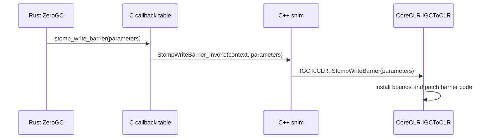
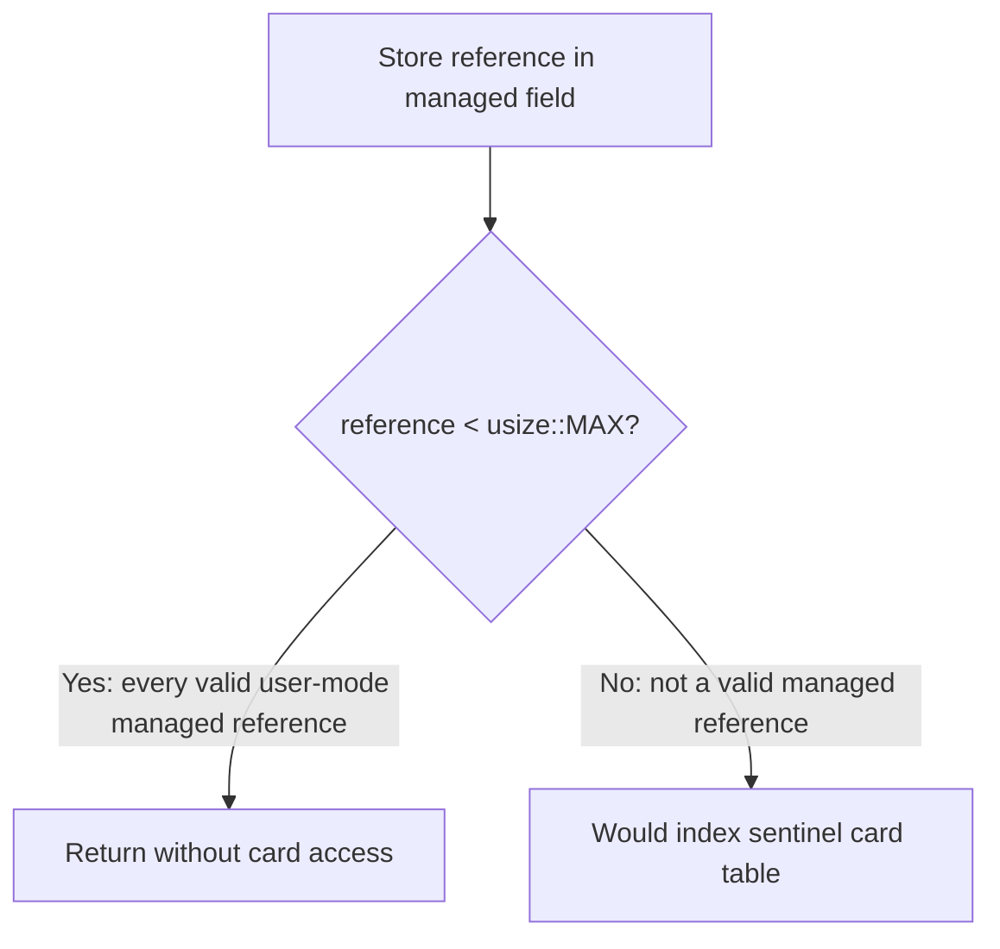

# ZeroGC write-barrier configuration

Status: temporary Mission 03 design for the pinned CoreCLR build on Windows x64.
It is not a write-barrier design for the future collecting GC.

## Two different paths

`StompWriteBarrier` is a rare control operation. It configures or patches the
write barrier that managed code subsequently executes for reference stores.



The C++ shim owns the C++ virtual call. Rust retains only a process-lifetime
context pointer and a C-compatible callback, so it does not depend on the
`IGCToCLR` vtable layout.

## Current inert configuration

Mission 03 allocates every object separately and never collects. There is no
meaningful young generation or remembered set, but CoreCLR still requires a
write-barrier configuration during initialization.

The current values are:

| Parameter | ZeroGC value | Purpose |
| --- | --- | --- |
| `lowest_address` | `1` | Synthetic lower heap bound |
| `highest_address` | `usize::MAX` | Synthetic upper heap bound |
| `ephemeral_low` | `usize::MAX` | Makes the ephemeral interval empty |
| `ephemeral_high` | `usize::MAX` | Makes the ephemeral interval empty |
| `card_table` | Address of one static `u32` | Non-null sentinel only |
| `card_bundle_table` | Same sentinel | Non-null sentinel only |

These values are installed in
[`gc_heap.rs`](../crates/gc-rust/src/gc_heap.rs). The sentinel is not a small but
functional card table; indexing it with a managed address would be invalid.

## Why the sentinel is not accessed

The pinned Windows x64 pre-grow barrier behaves approximately as follows:

```text
store reference at destination

if reference < ephemeral_low:
    return

card_table[destination >> 11] = dirty
```



Every valid Windows user-mode managed address, including null, is below
`usize::MAX`. Therefore the store completes and the barrier exits before card
metadata is touched. The relevant machine-code implementation is
[`JIT_WriteBarrier_PreGrow64`](../external/dotnet-runtime/src/coreclr/vm/amd64/JitHelpers_FastWriteBarriers.asm).

This deliberately discards remembered-set information. That does not affect
Mission 03 because ZeroGC never starts a collection that could consume it.

## Validity envelope

The argument above is valid only while all of the following remain true:

- The pinned Windows x64 CoreCLR uses the expected pre-grow barrier variant.
- Region and software write-watch barriers remain disabled.
- No collection, heap walk, or remembered-set consumer is introduced.
- Objects remain stable and allocated for the process lifetime.
- Runtime features are not allowed to treat the synthetic heap bounds as a real
  description of managed memory.

The debug smoke test should include instance-field, array-element, and static
managed-reference assignments. Object allocation alone does not prove that the
write-barrier path is safe.

## Mandatory replacement

Mission 13 must replace this configuration when it introduces a reserved,
contiguous managed heap:

1. Publish the actual reserved and committed heap bounds.
2. Allocate card metadata that covers the managed address range and apply the
   bias expected by the pinned CoreCLR barrier.
3. Define real generation or non-generational semantics instead of using an
   empty sentinel interval.
4. Update the barrier with `StompResize` whenever published bounds or metadata
   move.
5. Add tests that deliberately dirty and inspect cards before any collector
   relies on the remembered set.

Until that replacement, this mechanism is an intentionally constrained ZeroGC
bootstrap, not a partial implementation of a production card table.
